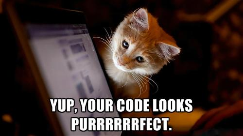
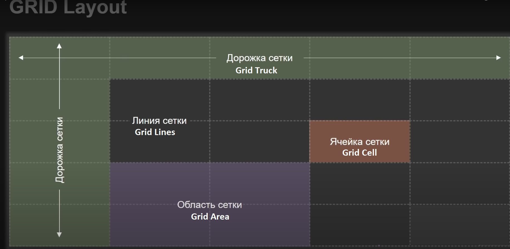

<h1 align="center"> Hello, it's me, Valentino! I'm an average <a href="https://github.com/kottans">Kottans</a>  enjoyer. :sunglasses: <height="32"/></h1>
<br>
<p align="center">
   
</p>
<p align="center">
<a href="https://git.io/typing-svg"></a>
</p>

***

# #Kottans Front-End

### This repository is to track and share my progress on [Front-End Course](https://github.com/kottans/frontend) from [Kottans](https://github.com/kottans) 🇺🇦

***

<details>
<summary><h3> :pushpin:Before we started:pushpin: </h4></summary>
    
#### In this section i want to publish some useful links, what we need to get started, some briefly info for my future self or for someone who will find it useful.
 
#### Links:
:link: [Kottans Front-End main page repo](https://github.com/kottans/frontend) | :link: [Kottans FAQ](https://github.com/kottans/frontend/blob/2022_UA/faq.md) | :link: [Contents](https://github.com/kottans/frontend/blob/2022_UA/contents.md)
  <br>
:link: [GIT](https://git-scm.com/)
  <br>
:link: [Visual Studio Code](https://code.visualstudio.com/)
  <br>
:link: [Oracle VirtualBox](https://www.virtualbox.org/)
  <br>
:link: [Ubuntu](https://ubuntu.com/)
  <br>
:link: [Writing on GitHub](https://docs.github.com/en/get-started/writing-on-github) | :link:[Communicate using Markdown](https://github.com/skills/communicate-using-markdown)
  <br>
 
  <details>
<summary><h3> GIT/GitHub </h4></summary>
    
:link:[Generating a new SSH key](https://docs.github.com/en/authentication/connecting-to-github-with-ssh/generating-a-new-ssh-key-and-adding-it-to-the-ssh-agent) | :link:[Adding a new SSH key to your GitHub](https://docs.github.com/en/authentication/connecting-to-github-with-ssh/adding-a-new-ssh-key-to-your-github-account) | :link:[Testing your SSH connection](https://docs.github.com/en/authentication/connecting-to-github-with-ssh/testing-your-ssh-connection)
    
##### You can access and write data in repositories on GitHub.com using SSH (Secure Shell Protocol).When you connect via SSH, you authenticate using a private key file on your local machine. When you set up SSH, you will need to generate a new private SSH key and add it to the SSH agent. You must also add the public SSH key to your account on GitHub before you use the key to authenticate.
<br>
Before you start you need to install Git Bash if you're using Windows
https://git-scm.com/
<br>
    
#### :white_medium_square:Generating a new SSH key
    
<br>

##### You can generate a new SSH key on your local machine. After you generate the key, you can add the key to your account on GitHub.com to enable authentication for Git operations over SSH.
<br>
Paste the text below, substituting in your GitHub email address:
<br>
    
```
    
$ ssh-keygen -t ed25519 -C "your_email@example.com"
    
```
When you're prompted to "Enter a file in which to save the key," press Enter. This accepts the default file location.
At the prompt, type a secure passphrase.
    


#### :white_medium_square:Adding a new SSH key to your account    
<br>
After you generate an SSH key pair, you must add the public key to GitHub.com to enable SSH access for your account.
You can locate the hidden .ssh folder, open the file in your favorite text editor, and copy it to your clipboard.
<br>
Then on GitHub you need to add SSH key:
<br>
    
__Settings__ > __SSH and GPG keys__ > __New SSH key__ or __Add SSH key__

#### :white_medium_square:Testing your SSH connection
After you've set up your SSH key and added it to your account on GitHub.com, you can test your connection.
    
```
    $ ssh -T git@github.com
```
You may see a warning like this:

```
> The authenticity of host 'github.com (IP ADDRESS)' can't be established.
> RSA key fingerprint is SHA256:nThbg6kXUpJWGl7E1IGOCspRomTxdCARLviKw6E5SY8.
> Are you sure you want to continue connecting (yes/no)?
```
    
 
    
   </details>
 
<!-- :link: []() -->
___
 
#### #How I structure the content:
 
  #### I'll answer questions in the end of every section.
1. _What's was new to me:_
1. _Thing that amazed me:_
1. _Thing that i going to use in the future:_
 
  #### I'll add screenshots with progress.:camera_flash:
 
  #### I'll add an unformatted summary (just some notes for myself).:memo:
 
  ___
 
### #My progress
<details>
    <summary><h5>General:white_check_mark:</h5></summary>
    
- [x] 0. Git Basics
- [x] 1. Linux CLI and Networking
- [x] 2. VCS (hello gitty), GitHub and Collaboration
</details>
 
<details>
    <summary><h5>Front-End Basics</h5></summary>
    
- [x] 3. Intro to HTML & CSS
- [ ] 4. Responsive Web Design
- [ ] 5. HTML & CSS Practice
- [ ] 6. JavaScript Basics
- [ ] 7. Document Object Model - practice
 </details>
 
 </details>
 
***
<p align="center">
   
</p>

***
<!-------------------------------Stage0------------------------------------->

# #Stage 0
<!-------------------------------General------------------------------------>

<details>
<summary><h2> General:heavy_check_mark: </h2></summary>
<!-------------------------------Git Basics--------------------------------->
  
<details>
<summary><h3> 0. Git Basics </h3></summary>
    
  :link:[Tasks](https://github.com/kottans/frontend/blob/2022_UA/tasks/git-intro.md)
   
   Useful links: :link:[Лекція по Git від Олексія Руденка](https://www.youtube.com/playlist?list=PLS8sEUxbfFY9MnPIFPTNlaS5xX7P5Ge-5) | :link:[Git за 30 хвилин](https://codeguida.com/post/453) | :link:[Submit A Pull Request](https://learntocodetogether.com/create-your-first-pull-request/)
   
## 1. Introduction to Git and GitHub   
1. _What's was new to me:_
   
     VCS, GIT, branches
1. _Thing that amazed me:_
   
     Track file state (**modified**, **staged** or **committed**);
  - File tracked by Git, will first be modified when we change it in any way. 
  - Then it becomes staged when we mark those changes for tracking.
  - And finally it will get committed when we store those changes in the VCS;
   Merging.
3. _Thing that i going to use in the future:_
   
   `git init`, `git clone`, `git add`, `git commit -a -m`, `git checkout -b new branch`, `git merge`. 
   
  <details>
 <summary><h4> :camera_flash:Screenshots </h4></summary>
    
  
  
    
  </details>
      
  <details>
 <summary><h4> :memo:Notes </h4></summary>
      
   _Tracked_ files are part of the snapshots, while _untracked_ files aren't a part of snapshots yet.
Each track file can be in one of three main states: ___modified___, ___staged___ or ___committed___.

`~$ git init`       [create a new git repository]
     
`~$ git clone`      [clone existing git repository]
```     
~$ git add        [add file to staging area]
         flags to git add:
               -p [to review changes before adding them]
```   
`~$ git status`   [info about current working tree and pending changes]
```     
~$ git commit   [to get commited]  
         flags to git commit: 
            -m ‘add comment’
     -a [shortcut to stage any changes to tracked files and commit them in one step]
```
`~$ git config -l` 
```     
~$ git log [check the history of the commits]
    flags to git log:
     -p     [ using this flag gives us the patch that was created]
    --stat  [which files were changed and how many lines were added or removed]
      -2    [any number, limits output to this parameters]
```
`~$ git rm` [remove files from your repository]
     
`~$ git mv` [rename files in your repository]

`~$ git checkout` [reverts changes to modified files before they are staged]
     
`~$ git reset`    [reverts changes(unstage) to staged files ]

`~$ git commit --amend` [ to overwrite the previous commit]
     
`~$ git revert`         [ it creates a commit that contains the inverse of all the changes made in the bad commit in order to cancel them out ]

`~$ git checkout <branch>`      [Switches to a branch]
     
`~$ git checkout -b new branch` [to create a new branch and to switch to it]

__Merging__ is the term that Git uses for combining branch data and history together.

`~$ git merge` [take the independent snapshots and history of one Git branch, and tangle them into another]
     
`~$ git merge --abort` [this will stop the merge and reset the files in your working tree back to the previous commit before the merge ever happened]

`~$ git log --graph --oneline` [--graph for seeing the commits as a graph, and --oneline to only see one line per commit]

`.gitignore` [file that contains list of file that need to be ignored in repo] 

     
  <details>
 <summary><h4> more </h4></summary>
  
```
 diff
    
diff is used to find differences between two files. On its own, it’s a bit hard to use; instead, use it with diff -u to find lines which differ in two files:
~$ diff -u menu1.txt menu2.txt
    
Patch
    
Patch is useful for applying file differences. See the below example, which compares two files. The comparison is saved as a .diff file, which is then patched to the original file!
~$ diff -u menu1.txt menu2.txt > menu.diff
~$ patch menu1.txt < menu.diff
                              
Using GIT

The area outside the git directory is the working tree.
The working tree is the current version of your project.
You can think of it like a workbench or a sandbox where you perform all the modifications you want to your file. This working tree will contain all the files that are currently tracked by Git and any new files that we haven't yet added to the list of track files.

~$ git init        [create a new git repository]
~$ git clone       [clone existing git repository]
~$ git add         [add file to staging area] 
    flags to git add:
      -p [to review changes before adding them]


To make Git track our file, we'll add it to the project using the git add command. With that added our file to the staging area (index).The staging area which is also known as the index is a file maintained by Git that contains all of the information about what files and changes are going to go into your next commit.

~$ git status     [info about current working tree and pending changes]  
~$ git commit     [to get commited]
      flags to git commit: 
         -m ‘add comment’
         -a [shortcut to stage any changes to tracked files and commit them in one step]

~$ git config -l 
~$ git log    [check the history of the commits]
    flags to git log:
           -p [ using this flag gives us the patch that was created]
       --stat [which files were changed and how many lines were added or removed]
           -2 [any number, limits output to this parameters]
                              
Tracked files are part of the snapshots, while untracked files aren't a part of snapshots yet.
Each track file can be in one of three main states: modified, staged or committed.

File tracked by Git, will first be modified when we change it in any way. 
Then it becomes staged when we mark those changes for tracking.
And finally it will get committed when we store those changes in the VCS.


Advanced Git interactions 

Git uses the HEAD alias to represent the currently checked out snapshot of your project.
Think of HEAD as a pointer to the current branch.

~$ git show “commit ID” [display the information about the commit and the associated patch]
~$ git diff [ same as diff -u]
git diff shows only unstaged changes by default
    flags to git diff : 
      --staged [to see the changes that are staged but not committed]

~$ git rm [remove files from your repository]
~$ git mv [rename files in your repository]

.gitignore [file that contains list of file that need to be ignored in repo] 

Undoing Changes Before Committing

~$ git checkout [reverts changes to modified files before they are staged]
~$ git reset    [reverts changes(unstage) to staged files ]

~$ git commit --amend [ to overwrite the previous commit]
~$ git revert         [ it creates a commit that contains the inverse of all the changes made in the bad commit in order to cancel them out ]

Branching and Merging

The default branch that Git creates for you when a new repository initialized is called master.

~$ git branch [ list, create, delete, and manipulate branches. Running git branch by itself will show you a list of all the branches in your repository ]
    flags to git branch:
          -d [delete branch]
~$ git checkout <branch> [Switches to a branch]

~$ git checkout -b new branch [to create a new branch and to switch to it]
  
Merging is the term that Git uses for combining branch data and history together.

~$ git merge [take the independent snapshots and history of one Git branch, and tangle them into another]
~$ git merge --abort [this will stop the merge and reset the files in your working tree back to the previous commit before the merge ever happened]

~$ git log --graph --oneline [--graph for seeing the commits as a graph, and --oneline to only see one line per commit]

```
  </details>
    
  </details>
  
 
  
<!------------------------------- learngitbranching.js.org  --------------------------------->
   
## 2. learngitbranching.js.org   
1. _What's was new to me:_
                              
 `git switch` - more logical for me than `git checkout` (verbally closer)
                              
 `git fetch` , `git pull` , `git push` 
                              
1. _Thing that amazed me:_
                              
 `git pull` = `git fetch` + `git merge`
                              
1. _Thing that i going to use in the future:_
                              
`git switch` , `git rebase` , `git fetch` , `git pull` , `git push`
    
  <details>
 <summary><h4> :camera_flash:Screenshots </h4></summary>

 
 

  </details>
      
  <details>
 <summary><h4> :memo:Notes </h4></summary>
     
`~$ git rebase` [Rebasing essentially takes a set of commits, "copies" them, and plops them down somewhere else.]
     
   to **fetch** data from a remote repository - the command for this is conveniently named `git fetch`
     
   `git pull` is essentially shorthand for a *git fetch* followed by a *merge* of whatever branch was just fetched.
     
   `git push` is responsible for uploading your changes to a specified remote and updating that remote to incorporate your new commits. Once git push completes, all your friends can then download your work from the remote
     
   `git pull --rebase` is shorthand for a fetch and a rebase
     
  <details>
 <summary><h4> more </h4></summary>
 

     
  </details>
    
  </details>
    
<!-------------------------------  PR Kottans/mock-repo        --------------------------------->
     
***
     
  <details>
<summary><h3> PR mock-repo </h3></summary>

 ## 6. PR Kottans/mock-repo
     
1. Fork Kottans/mock-repo
2. `git clone https://github.com/Chotogde/mock-repo.git`
     
	2.1 `cd mock-repo`
3. `git remote add upstream https://github.com/kottans/mock-repo.git`
4. `git checkout master`
     
	4.1 `git checkout -b second`
5. `code .`
     
	5.1 opens in VScode , add some greeting info
     
	5.2 save without formating `ctrl+shift+P` in VScode
     
	5.3. check status of branch `git status`
     
6. Add commit `git commit-a -m ‘Add greetings to readme’`
7. Switch branch to master
	`git switch master` or `git checkout master`
8. `git pull upstream master`
9. `git checkout second && git merge master`
10. `git push --set-upstream origin second`
11. pull-request from my repo to kottans/mock-repo with GitHub web-interface
 
  <details>
<summary><h4> :camera_flash:Screenshots for PR </h4></summary>
     
  
     
   </details>
</details>
     
***
     
  </details>
<!-------------------------------   Linux CLI and Networking       --------------------------------->
     
  <details>
<summary><h3> 1. Linux CLI and Networking </h4></summary>
   
 :link:
 
 ## 1. Linux Survival (4 modules)   
1. _What's was new to me:_

   `'?'` It matches exactly one character ; `lpq` ; `kill -9`

1. _Thing that amazed me:_

   If don't give any argument to the `cd` command, then it will go to your home directory by default.

1. _Thing that i going to use in the future:_

   all the commands are useful, in the future I will use all of them.
    
  <details>
 <summary><h4> :camera_flash:Screenshots </h4></summary>

 
 
 
 

  </details>
      
  <details>
 <summary><h4> :memo:Notes </h4></summary>
      
  `ls` [list the contents of a directory]
  
`mkdir` [make directory]

`mv` [move a file] / rename file (e.x. mv wolves coyotes)

`cd` [change directory]

`cd ..` [To change to your previous directory (also known as the "parent" directory)

 "..", it refers to the directory above your current directory.]
 
`pwd` [print working directory]
______________

`cp` [copy]

`rm` [remove]

`rmdir` [remove directory]

`ls -l` [long listing]

`chmod` [change mode]
e.x.     "rwx" sets "user", "group", and "other"
chmod o+x gorillas
chmod ugo-rwx gorillas

`'*'` It matches any number of characters

`'?'` It matches exactly one character.

`groups` [To get a listing of your group memberships]

______________

`~` [ home directory] e.x. "/home/keeper". cp ~/jokes /tmp  cp /home/keeper/jokes /tmp

`cd ~ (User ID)` e.x. cd ~bookie

`man` ["manual"]

`finger`  - user information lookup program 

`cat` [can combine files for output] \ more 

> if you do not give any argument to the "cd" command, then it will go to your home directory by default. 

`lpr` [line printer] send to printer
 e.x. lpr -P hp14 thoughts ['-P' stands for "printer"]
 
`lpq` display print queue

`lprm` remove from print queue

`find` [locate files]

`.` [current directory]

______________

> The regular "cp" command will not let you copy directories, but if you use the "-r" option, it will.
> > e.x.  cp -r ~jester/jokes ~

`df` [disk free]

`rm -r` [allows you to remove an entire directory tree]

`ps` [process status]

`ps aux` [detailed list of all processes]

`"|"`[pipe] it "pipes" data from one command to another

`grep` [You can use "grep" to find patterns in data]

`kill PID` [To kill a process, where PID is the ID of the process you want to kill]

`kill -9` [kill immediately]

    
  </details>
  
  ## 2-3. HTTP

:link:[HTTP: The Protocol Every Web Developer Must Know—Part 1](https://code.tutsplus.com/tutorials/http-the-protocol-every-web-developer-must-know-part-1--net-31177?ec_unit=translation-info-language)

:link:[HTTP: The Protocol Every Web Developer Must Know—Part 2](https://code.tutsplus.com/tutorials/http-the-protocol-every-web-developer-must-know-part-2--net-31155?ec_unit=translation-info-language)

<details>
 <summary><h4> :memo:Notes </h4></summary>
 
 **Basics of HTTP request and response**
 **HTTP Request Verbs**

_There are four universally applicable HTTP verbs in a request:_

- `GET`: fetch a resource from the server. For a GET request, the URL should carry all the required pieces of information for the server to spot the right resource. It does not have a message body.
- `POST`: create a new resource. The request has an optional payload which helps the server create a new resource.
- `PUT`: update an existing resource. The request should have an optional payload to help the server update an existing resource.
- `DELETE`: delete an existing resource.

_There are some less-used verbs too. A few to consider are:_

- `HEAD` is similar to GET, but without the message body. It's used to retrieve the server headers for a particular resource, generally to check if the resource has changed, via timestamps.
- `TRACE` is used to retrieve the hops that a request takes during a round trip from the server. Each intermediate proxy or gateway would inject its IP or DNS name into the Via header field. This can be used for diagnostic purposes.
- `OPTIONS` is used to retrieve server capabilities. On the client side, it can be used to modify the request based on what the server supports.

_There are two types of caches:_

   ***Public Cache***: stores the server response for multiple users. This calls for customized infrastructure to allow a user to access the popular resource several times.
   
   ***Private Cache***: limited to a single user. The resource would be stored in the user's browser. As the user navigates, the resource will be loaded without multiple trips to the server. Caching makes content available, even when the user is offline. Commonly cached data includes usernames, passwords, URLs, browsing history, and web content.

**Cache Processing**

Regardless of where a cache is located, the process of maintaining a cache is quite similar:

* Receive request message.
* Parse the URL and headers.
* Look up a local copy; otherwise, fetch and store locally
* Do a freshness check to determine the age of the content in the cache; make a request to refresh the content only if necessary.
* Create the response from the cached body and updated headers.
* Send the response back to the client.
* Optionally, log the transaction.


</details>

<!-------------------------------   VCS (hello gitty), GitHub and Collaboration       --------------------------------->

 </details>
 
  <details>
<summary><h3> 2. VCS (hello gitty), GitHub and Collaboration </h4></summary>
  
  :link:[Tasks](https://github.com/kottans/frontend/blob/2022_UA/tasks/git-collaboration.md)
   
   Useful cheatsheets: :link:[One](https://github.com/Chotogde/kottans-frontend/blob/f03c0ccc35342aa43dc13191f32633eff5055ce1/readme_img/General/gitcheatsheet_1.png) | :link:[Two](https://github.com/Chotogde/kottans-frontend/blob/f03c0ccc35342aa43dc13191f32633eff5055ce1/readme_img/General/gitcheatsheet_2.png) | :link:[Three](https://github.com/Chotogde/kottans-frontend/blob/f03c0ccc35342aa43dc13191f32633eff5055ce1/readme_img/General/gitcheatsheet_github.pdf) | :link:[Four](https://github.com/Chotogde/kottans-frontend/blob/f03c0ccc35342aa43dc13191f32633eff5055ce1/readme_img/General/gitcheatsheet_gitlab.pdf) 
   
   Useful links: :link:[Git and GitHub by Brian Yu (CS50 course 2019)](https://www.youtube.com/watch?v=eulnSXkhE7I) | :link:[oh s**t git](https://ohshitgit.com/) | :link:[Flight rules for Git](https://github.com/k88hudson/git-flight-rules)
   
## 1. GitHub & Collaboration  

1. _What's was new to me:_

   `git branch -d BranchName` To remove the local branch.
  
   `git push --delete origin BranchName` To remove the remote branch
  
1. _Thing that amazed me:_

   `git push -f` to force git to push the current snapshot into the repo as is
   (we want to replace the old commits with the new one)
  
1. _Thing that i going to use in the future:_

     `git push -u origin BranchName` , and git command to remove local\remote branch
    
  <details>
 <summary><h4> :camera_flash:Screenshots </h4></summary>

 
 
 
  </details>
      
  <details>
 <summary><h4>:memo:Notes </h4></summary>
      
`git config --global credential.helper cache`

`git remote -v` [look origin repo url]

`git push -u origin BranchName`

`git push --delete origin BranchName` [To remove the remote branch]

`git branch -d BranchName` [To remove the local branch]

`git push -f` to force git to push the current snapshot into the repo as is
   (we want to replace the old commits with the new one) 

  ***Best Practices for Collaboration***
  
  - always synchronize your branches before starting any work on your own
  - avoid having very large changes that modify a lot of different things
  - when working on a big change, it makes sense to have a separate feature branch
  - regularly merge changes made on the master branch back onto the feature branch
  - have the latest version of the project in the master branch and a stable version of the project on a separate branch
  - you shouldn't rebase changes that have been pushed to remote repos
  - having good commit messages is important

      
  <details>
 <summary><h4> more </h4></summary>

**Forking** is a way of creating a copy of the given repository so that it belongs to our user.
A **pull request** is a _commit_ or series of _commits_ that you send to the owner of the repository so that they incorporate it into their tree.

We can write automated tests to test the code for us and then use a continuous integration or CI system to run those tests automatically.
A continuous integration system will build and test our code every time there's a change.
This means that it will run whenever there's a new commit in the main branch of our code.

Once we have our code automatically built and tested, the next automation step is continuous deployment which is sometimes called continuous delivery or CD. Continuous deployment means the new code is deployed often.
The goal is to avoid roll outs with a lot of changes between two versions of a project and instead do incremental updates with only a few changes at a time.
This allows errors to be caught and fixed early.

  </details>
    
  </details>


## 2. learngitbranching.js.org 

1. _What's was new to me:_

   `git cherry-pick <Commit1> <Commit2> <...>`
   [to copy a series of commits below your current location (HEAD)]

  

1. _Thing that amazed me:_

   _You can technically specify "nothing" as a valid source for both git push and git fetch. The way you specify nothing is via an empty argument:_

   `git push origin :side` (deletes)

   `git fetch origin :bugFix` (creates)


1. _Thing that i going to use in the future:_
    
    `git checkout -b totallyNotMain o/main` , `git branch -u o/main Branch`

    
  <details>
 <summary><h4> :camera_flash:Screenshots </h4></summary>

 
 
 
  </details>
      
  <details>
 <summary><h4>:memo:Notes </h4></summary>
      
 ***Remote***

  `git checkout -b totallyNotMain o/main`
  
  Creates a new branch named totallyNotMain and sets it to track o/main


  Another way to set remote tracking on a branch is to simply use the `git branch -u` option. 
  Running `git branch -u o/main foo` will set the foo branch to track o/main. If foo is currently checked out you can even leave it off:
  
  `git branch -u o/main`

  <details>
 <summary><h4> more </h4></summary>
 
  Detaching HEAD just means attaching it to a commit instead of a branch.

  Moving upwards one commit at a time with ^
  Moving upwards a number of times with ~<num>

  _tags_ exist as anchors in the commit tree that designate certain spots.
  `git tag v1 C1`

  Git will normally follow the "first" parent upwards from a merge commit, but specifying a number with ^ changes this default behavior.
  If we checkout main^ without the modifier, we will follow the first parent after the merge commit.
  
  `git checkout main^2`

  git push <remote> <place>
  git push origin main
  translates to this in English:
  _Go to the branch named "main" in my repository, grab all the commits, and then go to the branch "main" on the remote named "origin". Place whatever commits are missing on that branch and then tell me when you're done._
  
  _By specifying main as the "place" argument, we told git where the commits will come from and where the commits will go. It's essentially the "place" or "location" to synchronize between the two repositories._
  
  _Keep in mind that since we told git everything it needs to know (by specifying both arguments), it totally ignores where we are checked out!_

  For git push: In order to specify both the source and the destination of <place>, simply join the two together with a colon:\
  
  `git push origin <source>:<destination>`
  
  It's the same type of concepts but just applied in the opposite direction (since now you are downloading commits rather than uploading).
  If you specify a place with `git fetch` like in the following command:
  
 `git fetch origin foo`
 
  _Git will go to the foo branch on the remote, grab all the commits that aren't present locally, and then plop them down onto the o/foo branch locally._
  
  You can technically specify "nothing" as a valid source for both git push and git fetch. The way you specify nothing is via an empty argument:
  
  - `git push origin :side` (deletes)
  
  - `git fetch origin :bugFix` (creates)

  </details>
    
  </details>
   </details>
 
 ***
<p align="center">
   
</p>

***
 
</details>

<details>
<summary><h2> Front-End Basics </h2></summary>
	
<!-------------------------------3. Intro to HTML & CSS--------------------------------->
 
 <details>
<summary><h3> 3. Intro to HTML & CSS </h3></summary>
	
 :link:[Tasks](https://github.com/kottans/frontend/blob/2022_UA/tasks/html-css-intro.md)
	
 Useful cheatsheets: :link:[One](https://www.codecademy.com/learn/learn-html/modules/learn-html-elements/cheatsheet) | :link:[Two](https://www.codecademy.com/learn/paths/learn-css/tracks/learn-css/modules/syntax-and-selectors/cheatsheet)
   
 Useful links: :link:[codepen](https://codepen.io/) | :link:[Specificity Calculator](https://specificity.keegan.st/) 
    
## 1. Intro to HTML & CSS (coursera)  
## 2. Learn HTML (codecademy)
## 3. Learn CSS (codecademy)
	
I was already familiar with the basic concepts of HTML and CSS. Refreshed my memory a little but I also learned new things.
	
1. _What's was new to me:_
	
	`&nbsp;` no break space 
	
1. _Thing that amazed me:_
	
	`color: green !important` - > than specificity
	
1. _Thing that i going to use in the future:_
	
	all the commands are basic and useful, in the future I will use most of them.
   
  <details>
 <summary><h4> :camera_flash:Screenshots </h4></summary>

 
 

  </details>
      
  <details>
 <summary><h4>:memo:Notes </h4></summary>
	  
 <details>
 <summary><h4> Slides </h4></summary>
	 

.jpg)

	 
</details>
	  
`&nbsp;` no break space 
	  
```
<a href=”” title=”” target=”_blank”>text </a>
title=”” - for screen reader
target=”_blank” - forces the browser to open link in a new tab or window
#id - link to content ID on page
```
	  
`color: green !important` - > than specificity

`box-sizing: border-box;` to specifying the height and width of the content box, not the entire thing
`box-sizing: content-box;` original size, with borders
`box-sizing` - not inherit

	  
`overflow: ;`
`scroll, auto, hidden, visible, inherit`

`background-repeat: no-repeat;` 

`position: ;`
`relative, absolute,`

	  
  <details>
 <summary><h4> more </h4></summary>
 
```
Attributes can be selected similarly to types, classes, and IDs.
[href]{
   color: magenta;
}

The most basic syntax is an attribute surrounded by square brackets. In the above example: [href] would target all elements with an href attribute and set the color to magenta.
And it can get more granular from there by adding type and/or attribute values. One way is by using type[attribute*=value]. In short, this code selects an element where the attribute contains any instance of the specified value. Let’s take a look at an example.


The HTML code above renders two  elements, each containing a src attribute with a value equaling a link to an image file.
img[src*='winter'] {
  height: 50px;
}

img[src*='summer'] {
  height: 100px;
}


div.headline {
  width: 400px;
  margin: 0 auto;
}
In the example above, margin: 0 auto; will center the divs in their containing elements. The 0 sets the top and bottom margins to 0 pixels. The auto value instructs the browser to adjust the left and right margins until the element is centered within its containing element.
In order to center an element, a width must be set for that element. Otherwise, the width of the div will be automatically set to the full width of its containing element, like the <body>, for example. It’s not possible to center an element that takes up the full width of the page, since the width of the page can change due to display and/or browser window size.
Note: What’s the difference between display: none and visibility: hidden? An element with display: none will be completely removed from the web page. An element with visibility: hidden, however, will not be visible on the web page, but the space reserved for it will.
```

  </details>
    
  </details>
 
 </details>
 
<!-------------------------------          --------------------------------->

<!-------------------------------4. Responsive Web Design--------------------------------->
 
 <details>
<summary><h3> 4. Responsive Web Design </h3></summary>
	
 :link:[Tasks](https://github.com/kottans/frontend/blob/2022_UA/tasks/html-css-responsive.md)
	
 Useful links: :link:[Flex](https://fls.guru/flexbox.html) | :link:[Grid](https://fls.guru/grid.html) 
    
   1. Responsive web design basics  
   2. FLEXBOX (youtube/FreelancerLifeStyle)
   3. Flexbox Froggy (game)
   4. Grid (youtube/FreelancerLifeStyle)
   5. Grid Garden (game)
	
Oof. It was harder for me than I thought. At first, I had a lot of doubts, I thought that I would not understand the material. At first, I had a lot of doubts, I thought that I would not understand the material. But after a good night's sleep, everything fell into place. Like a puzzle (:

Froggy and grid garden games helped a lot.
	
1. _What's was new to me:_
	
	Flex, Grid. 
	
1. _Thing that amazed me:_
	
	How hard is Grid understanding to me 
	
1. _Thing that i going to use in the future:_
	
	Not sure, but Flex seems more easy for me to use it in projects (as of now)
   
  <details>
 <summary><h4> :camera_flash:Screenshots </h4></summary>

 
 

  </details>
      
  <details>
 <summary><h4>:memo:Notes </h4></summary>
	  
 <details>
 <summary><h4> Slides </h4></summary>
	 
 

	 
</details>
	  
	  
  <details>
 <summary><h4> more </h4></summary>
 
```
##Flex

display: flex;
display: inline-flex;

display: flex;
justify-content: flex-start; 
justify-content: flex-end;
justify-content: center;
justify-content: space-between;
justify-content: space-around;

align-items: stretch;
align-items: flex-start;
align-items: flex-end;
align-items: center;
align-items: baseline;

flex-wrap:nowrap;
flex-wrap: wrap;
flex-wrap: wrap-reverse;

align-self: ;  attributes as align-items

order: ; 

flex-basis: auto;
flex-basis: % px;
flex-grow: 0; 
flex-shrink: 1; 

flex: flex-grow flex-shrink flex-basis;
flex: 0 1 auto;


flex-direction: ; row, row-reverse, column, column-reverse

flex-direction: column;
align-items: stretch;
justify-content: space-between;

 flex-direction and flex-wrap = flex-flow
For example, you can use flex-flow: row wrap to set rows and wrap them.

align-content to set how multiple lines are spaced apart from each other. This property takes the following values:
flex-start: Lines are packed at the top of the container.
flex-end: Lines are packed at the bottom of the container.
center: Lines are packed at the vertical center of the container.
space-between: Lines display with equal spacing between them.
space-around: Lines display with equal spacing around them.
stretch: Lines are stretched to fit the container.
This can be confusing, but align-content determines the spacing between lines, while align-items determines how the items as a whole are aligned within the container. When there is only one line, align-content has no effect.

Шпаргалка по FLEXBOX // «Фрилансер по жизни»
https://fls.guru/flexbox.html


##Grid

display: grid;
display: inline-grid;

grid-template-columns: ;
grid-template-rows: ;

e.x.
grid-template-columns: 200px 150px 300px;
            minmax( 150px, 1fr)
auto
fit-content (400px)
repeat(3, 1fr)

1fr - единица гибкости


grid-template-areas: ;
“header header”
“side content”

grid-template:  / ;  rows / columns

grid-template:
 [start] “header header” 100px [row2]
 [row2] “side content” 1fr [row-end] / 150 1fr;

grid-auto-rows: 200px;
grid-auto-columns: ;

grid-auto-flow: 
        row, column, dense

grid-row-start
grid-row-end
grid-column-start
grid-column-end
            span 3

row-gap:
column-gap


Шпаргалка по CSS Grid Layout // «Фрилансер по жизни»
https://fls.guru/grid.html

```

  </details>
    
  </details>
 
 </details>
 
<!-------------------------------          --------------------------------->

</details>
